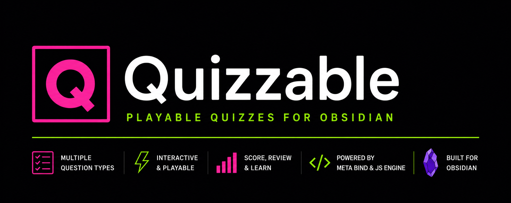

# Quizzable



<p align="center">  </p>

> Create and play interactive quizzes right inside your Obsidian notes.

Define a quiz in a simple YAML block, and Quizzable turns it into an
interactive widget you can answer, submit, score, and retry — without leaving
your note. It works completely offline and standalone, with an optional API for
power users (JS Engine, Dataview, Meta Bind).

<!--
Add screenshots/GIFs here, e.g.:

-->

---

## ✨ Features

- **7 question types** — multiple-choice, true/false, multiple-select, reorder,
  matching, short-text, and numeric.
- **Two play modes** — one question at a time, or all questions on one page.
- **Instant scoring** — points, percentage, and pass/fail against a passing
  score, with per-question feedback and explanations.
- **Partial credit** — for matching and (optionally) multiple-select.
- **Retry anytime** — reset a quiz with one click.
- **Optional progress saving** — resume where you left off (stored by the
  plugin; **your notes are never modified**).
- **Friendly errors** — a malformed quiz shows a clear message instead of
  breaking your note.
- **Themeable** — a bold neo-brutalist look built on your Obsidian theme's
  colors, so it fits light and dark modes.

---

## 📦 Installation

Quizzable isn't in the Community Plugins store yet, so install it
manually:

1. Download `main.js`, `manifest.json`, and `styles.css` from the
   [latest release](../../releases) (or build them yourself — see
   [Development](#-development)).
2. In your vault, create the folder:
   `<your-vault>/.obsidian/plugins/quizzable/`
3. Copy the three files into that folder.
4. In Obsidian, go to **Settings → Community plugins**, make sure
   **Restricted mode** is off, then **reload** the plugin list (or restart
   Obsidian).
5. Enable **Quizzable**.

> On Windows, `.obsidian` is a hidden folder. The most reliable way to find it
> is **Settings → Community plugins → the 📁 folder icon** next to
> "Installed plugins", which opens the correct plugins folder.

---

## 🚀 Quick start

Paste this into any note. Switch to **Reading view** (or click outside the
block) to play it:

````markdown
```playable-quiz
quiz:
  id: my-first-quiz
  title: My First Quiz
  mode: one-at-a-time
  passingScore: 70
  questions:
    - id: q1
      type: multiple-choice
      prompt: Which of these is a fruit?
      options:
        - id: a
          text: Carrot
        - id: b
          text: Apple
        - id: c
          text: Potato
      correctAnswer: b
      explanation: An apple is a fruit; the others are vegetables.
    - id: q2
      type: true-false
      prompt: The sky is green.
      correctAnswer: false
```
````

Answer the questions, hit **Submit** to see your score, then **Retry** to start
over.

> 💡 **YAML uses spaces, not tabs** — indent with 2 spaces per level.

### Define once, play anywhere (optional)

You can keep the definition in a `quiz` block and play it elsewhere in the same
note with a `playable-quiz` block:

````markdown
```quiz
quiz:
  id: capitals
  title: World Capitals
  questions:
    - id: q1
      type: short-text
      prompt: What is the capital of Japan?
      acceptedAnswers: [Tokyo]
```
````

````markdown
```playable-quiz
id: capitals
```
````

Use `source: current` instead of `id:` when a note contains exactly one quiz.

---

## 🧩 Question types

Every question needs `id`, `prompt`, and `type`. Optional on all types:
`points` (default `1`) and `explanation` (shown after submitting).

<details>
<summary><b>Multiple choice</b> — one correct option</summary>

```yaml
- id: q1
  type: multiple-choice
  prompt: Which service was used to subscribe to RSS feeds?
  options:
    - id: a
      text: GeoCities
    - id: b
      text: Google Reader
  correctAnswer: b
```
</details>

<details>
<summary><b>True / false</b></summary>

```yaml
- id: q2
  type: true-false
  prompt: StumbleUpon was used for website discovery.
  correctAnswer: true
```
</details>

<details>
<summary><b>Multiple select</b> — one or more correct options</summary>

```yaml
- id: q3
  type: multiple-select
  prompt: Which of these are web browsers?
  options:
    - id: firefox
      text: Firefox
    - id: chrome
      text: Chrome
    - id: obsidian
      text: Obsidian
  correctAnswers: [firefox, chrome]
  scoring: all-or-nothing   # or "partial"
```

- `all-or-nothing` (default): full points only for the exact set.
- `partial`: proportional credit, with a penalty for wrong picks.
</details>

<details>
<summary><b>Reorder</b> — put items in the right order (▲ / ▼ buttons)</summary>

```yaml
- id: q4
  type: reorder
  prompt: Put these web eras in chronological order.
  items:
    - id: static
      text: Static personal homepages
    - id: social
      text: Social networks
    - id: mobile
      text: Mobile-first platforms
  correctOrder: [static, social, mobile]
```
</details>

<details>
<summary><b>Matching</b> — pair each prompt with a choice</summary>

```yaml
- id: q5
  type: matching
  prompt: Match each service to its purpose.
  prompts:
    - id: reader
      text: Google Reader
    - id: aim
      text: AIM
  choices:
    - id: rss
      text: RSS subscriptions
    - id: chat
      text: Instant messaging
  correctMatches:
    reader: rss
    aim: chat
```

Matching awards **partial credit** — one share of the points per correct pair.
</details>

<details>
<summary><b>Short text</b> — type an answer</summary>

```yaml
- id: q6
  type: short-text
  prompt: What does RSS stand for?
  acceptedAnswers:
    - Really Simple Syndication
    - RDF Site Summary
  caseSensitive: false   # default
  trimWhitespace: true   # default
```

Matches any accepted answer (case-insensitive and trimmed by default).
</details>

<details>
<summary><b>Numeric</b> — enter a number</summary>

```yaml
- id: q7
  type: numeric
  prompt: How many bits are in one byte?
  correctAnswer: 8
  tolerance: 0        # allowed +/- margin
  # minimum: 0
  # maximum: 64
```
</details>

A complete note using **every** type is in
[`examples/All Question Types.md`](examples/All%20Question%20Types.md).

---

## ⚙️ Quiz options

Set these under `quiz:`:

| Field | Required | Description |
| --- | --- | --- |
| `id` | ✅ | Unique id for the quiz (used for saving progress). |
| `title` | ✅ | Displayed heading. |
| `description` | | Optional subtitle text. |
| `mode` | | `one-at-a-time` (default) or `all-at-once`. |
| `passingScore` | | `0`–`100`; shows a pass/fail badge. |
| `persistAnswers` | | `false` to disable saving for this quiz. |
| `questions` | ✅ | The list of questions. |

---

## 🎛️ Settings

Open **Settings → Quizzable**:

| Setting | Default | What it does |
| --- | --- | --- |
| Persist attempts | Plugin data only | Save progress so quizzes resume. `Disabled` turns it off. |
| Show explanations after submission | On | Reveal explanations once submitted. |
| Allow answer changes before submission | On | Lock the first answer when off. |
| Show pass/fail result | On | Show a badge when a passing score is set. |
| Export result properties to frontmatter | **Off** | Write results into the note (for Dataview/Meta Bind). |
| Frontmatter property prefix | `quizResults` | Key used when exporting results. |

---

## 🧰 Commands

Available from the command palette:

- **Reset quizzes in current note**
- **Submit quizzes in current note**
- **Clear saved quiz attempts for current note**
- **Open Quizzable settings**

---

## 🔌 For power users (optional integrations)

Quizzable exposes a small API and fires workspace events, so you can read
results from **Dataview / DataviewJS**, **JS Engine**, or **Meta Bind** — none of
which are required.

**Read a result with DataviewJS:**

```js
const api = app.plugins.plugins["quizzable"]?.api;
const result = api?.getResult(dv.current().file.path, "my-first-quiz");
dv.paragraph(result ? `You scored ${result.percentage}%` : "Not submitted yet.");
```

**React to submissions:**

```js
const ref = app.workspace.on("quizzable:submitted", (p) => {
  console.log(p.quizId, p.result.percentage);
});
// later: app.workspace.offref(ref);
```

**Meta Bind:** turn on *Export result properties to frontmatter*. After a
submission, your note's frontmatter gains a bindable object:

```yaml
quizResults:
  my-first-quiz:
    score: 4
    totalPoints: 5
    percentage: 80
    passed: true
```

This is the **only** feature that writes to your note, and it's off by default.

Full API and event details live in
[`examples/`](examples/) and the source under `src/integrations/`.

---

## 🩹 Troubleshooting

**The plugin doesn't appear after installing.**
Make sure the three files are directly inside a folder named `quizzable`
under `.obsidian/plugins/` (not a nested subfolder, and the config folder must
be `.obsidian` with a leading dot). Then **reload** the plugin list or restart
Obsidian. Turn off Restricted mode.

**My changes to a file don't show up.**
After replacing `main.js`/`styles.css`, **toggle the plugin off and on** (or
restart Obsidian) — Obsidian only loads plugin files on (re)load.

**A quiz shows a red error box.**
That's intentional — it lists exactly what's wrong (usually a YAML indentation
issue or a mismatched id). Fix the listed items and it'll render.

---

## 🗺️ Roadmap

Planned, not yet implemented:

- Personality / outcome quizzes (weighted, non-scored results)
- Fill-in-the-blank, fuzzy text matching
- Drag-and-drop reordering
- Timers, question pools, and shuffling
- Community Plugins store submission

---

## 🛠️ Development

```bash
npm install       # install dependencies
npm run dev       # esbuild watch (rebuilds main.js on change)
npm test          # run the unit tests (Vitest)
npm run typecheck # strict TypeScript check
npm run build     # typecheck + production bundle
```

The codebase separates parsing, validation, scoring, state, persistence, and
rendering, and adds new question types through isolated handlers + views (no
central switch statements). All core logic is unit-tested.

Contributions and issues are welcome.

---

## 📄 License

[MIT](LICENSE)
